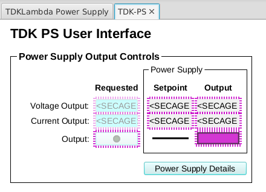
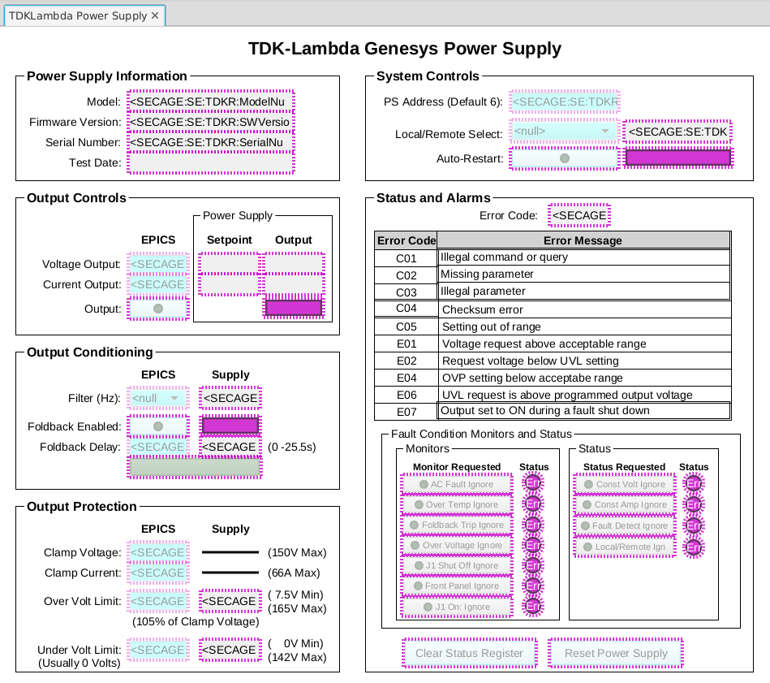

# TDKLambda 
EPICS support for control and monitoring of a TDKLambda power supply. This support includes drivers for an RS-232 serial interface through a MOXA type serial device and also support for an ethernet interface.

Serial EPICS support is based on [Asyn](http://www.aps.anl.gov/epics/modules/soft/asyn/) and [Stream Device](http://epics.web.psi.ch/software/streamdevice/). This is the IOC default.

Ethernet support is also based on [Asyn](http://www.aps.anl.gov/epics/modules/soft/asyn/) but interfaces directly to the device through port number 8003.

It has been our experience that the Ethernet interface was slightly less reliable over a long period of time. This was the reason for moving to a serial interface.

The module provides support for:

 * Main display On/Off, Aoltage and Current control and feedback
 * Detailed display showing PS information, Output conditioning, Protection and System Contols
 * Alarm Setpoints, Displays and Status

# GUI examples

## Abbreviated Main Display
<!-- blank line -->

<!-- blank line -->
## Detailed Power Supply Systems Display
<!-- blank line -->

<!-- blank line -->
# Contributors
There were many contributors to this IOC:
Matt Waddel
Gary Taufer
Matt Pearson
Carl Lionberger
